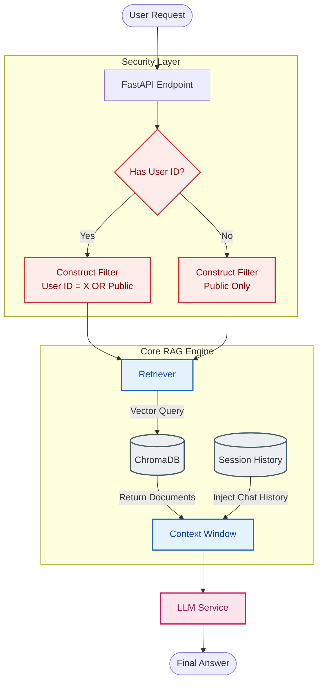

# 🚀 The Evolution of RAG: From Toy to Tool

*Why 90% of RAG tutorials fail in production, and how **TheUltimateRAG** solves it.*

---

## 🧐 The State of RAG Today

Retrieval-Augmented Generation (RAG) has taken the AI world by storm. It's the magic glue that connects your private data to powerful LLMs like GPT-4. But if you've ever tried to take a "YouTube Tutorial RAG" into production, you've likely hit a wall.

### The "Tutorial Trap"
Most open-source RAG boilerplates suffer from critical flaws:
1.  **Data Leaks**: User A can accidentally query User B's documents.
2.  **Goldfish Memory**: Every message is a fresh start; the context is lost immediately.
3.  **Rigid Logic**: Hardcoded prompts and model parameters.
4.  **Siloed Knowledge**: No way to share "Company Policy" (Common Data) while keeping "Payroll Details" (Private Data) secure.

**This is why we built TheUltimateRAG.**

---

## 🛠️ What Makes "TheUltimateRAG" Different?

We didn't just build a wrapper around LangChain. We built a **System**.

### 1. True Multi-User Isolation 🛡️
Security isn't an afterthought. We use metadata filtering at the database level to ensure strict isolation.

*   **Private Data**: Tagged with a User ID. Only THAT user can see it.
*   **Common Data**: Tagged as "Common". Everyone can see it.
*   **The Magic**: When you query, the system dynamically constructs a security filter:
    > *"Show me documents where (Owner == ME) OR (Access == PUBLIC)"*

### 2. Intelligent Memory 🧠
Conversations are continuous. Our `MemoryManager` maintains a sliding window of context, ensuring the LLM remembers *what* you just said, without overflowing the token limit.

### 3. Developer Control 🎛️
Stop fighting the framework.
*   **Dynamic Temperature**: Need creative writing? Set `temp=0.9`. Need strict facts? Set `temp=0.1`. Per request.
*   **System Prompts**: Change the AI's persona on the fly via the API.

---

## 📊 Architecture Deep Dive

Understanding the flow of data is crucial. Here is how **TheUltimateRAG** handles a request under the hood.

### The "Hybrid Retrieval" Flow

---

## 🆚 Feature Showdown

Why choose TheUltimateRAG over a standard `langchain serve` setup?

| Feature | ❌ Standard Tutorial RAG | ✅ TheUltimateRAG |
| :--- | :---: | :---: |
| **Data Isolation** | 🚫 None (All shared) | 🔒 **Strict Multi-User** |
| **Org / Common Data** | 🚫 Impossible | 🏢 **Built-in Support** |
| **Memory** | 🚫 Stateless | 🧠 **Session-Aware** |
| **LLM Parameters** | 🔒 Hardcoded | 🎛️ **API Configurable** |
| **Ingestion Security** | 🔓 Open / Unsafe | 🛡️ **Owner Enforced** |
| **Architecture** | 🍝 Spaghetti Scripts | 🧩 **Modular & Scalable** |

---

## 💡 Real World Use Case: The "Enterprise Employee Bot"

Imagine deploying a bot for your company.

1.  **HR Manager (User A)** uploads:
    *   *Company_Holoday_List.pdf* (Access: **Common**)
    *   *Employee_Salaries_2024.pdf* (Access: **Private**)

2.  **Regular Employee (User B)** queries:
    *   *"When is the next holiday?"* -> **RAG finds it.** (Common Data)
    *   *"What is John's salary?"* -> **RAG finds NOTHING.** (Private Data excluded)
    
3.  **HR Manager (User A)** queries:
    *   *"What is John's salary?"* -> **RAG finds it.** (Owns Private Data)

This granularity is what makes a RAG system **usable**.

---

## 🏁 Conclusion

Building an AI app is easy. Building a *secure, usable* AI app is hard. **TheUltimateRAG** handles the hard parts—memory, security, and flexibility—so you can focus on your prompt engineering and product logic.

[**Get Started on GitHub**](https://github.com/Matrixxboy/TheUnltimateRAG)

